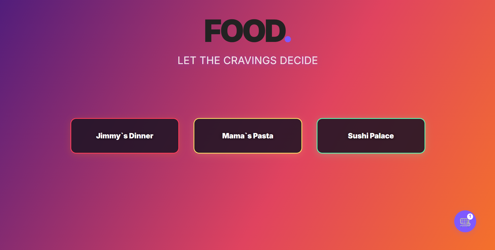
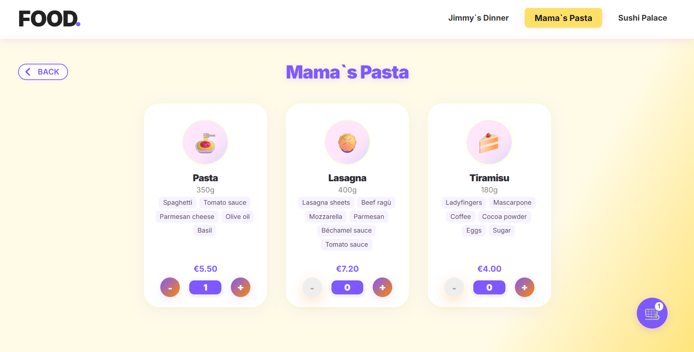
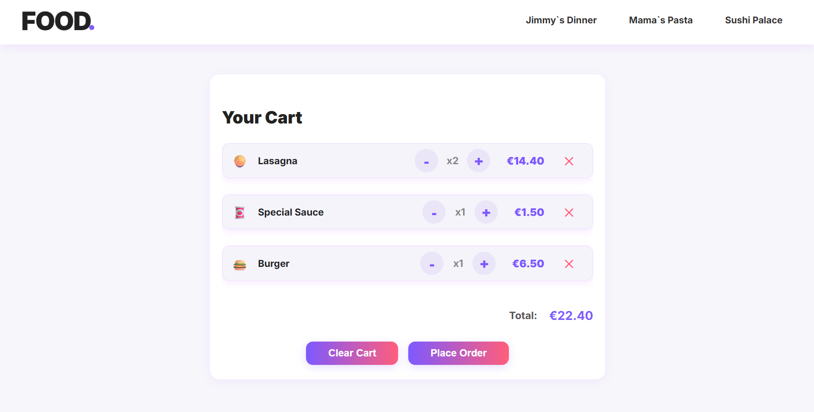

# Food.

A modern, responsive demo app for food delivery, featuring restaurant selection, product menus, cart management, and order placement. Built with React and Tailwind CSS. Perfect for portfolio showcase!

---

## Live Demo

[See it live here!](https://foodrmc.netlify.app/)

---

## Screenshots





---

## Features

- **Restaurant selection**: Choose from multiple themed restaurants
- **Dynamic product menus**: Browse dishes, see details and ingredients
- **Cart management**: Add, remove, and update product quantities
- **Order placement**: Simple checkout form with instant confirmation
- **Persistent cart**: Items remain after refresh with `localStorage`
- **Mobile friendly**: Fully responsive design
- **Smooth UI/UX**: Custom modals, toasts & visual feedback

---

## Tech Stack

- [React](https://react.dev/)
- [React Router](https://reactrouter.com/)
- [Tailwind CSS](https://tailwindcss.com/) (with custom CSS for branding)
- Local state & custom hooks (`useCart`)
- No backend – demo logic and data only

---

## Getting Started

1. **Clone the repo**
   ```bash
   git clone https://github.com/CosminMRotaru/o.git
   cd o
   ```

2. **Install dependencies**
   ```bash
   npm install
   ```

3. **Run the app locally**
   ```bash
   npm run dev
   ```

4. **Open in your browser**
   ```
   http://localhost:5173
   ```

---

## Project Structure

```
src/
  components/    // Reusable UI components (Navbar, Modal, Cart, etc)
  data/          // Demo data for restaurants and products
  hooks/         // Custom React hooks (cart logic)
  pages/         // Main pages: Homepage, Restaurant, Cart
  index.css      // Tailwind & custom styles
  App.jsx        // App routing and main logic
```

---

## Customization

- **Add more restaurants/products**: Edit `src/data/restaurants.js`
- **Change theme colors**: Update CSS variables in `index.css`
- **Integrate a backend**: Replace data in `restaurants.js` with API requests

---

## Limitations & Ideas for Improvement

- No real orders: demo only, form does not send data to a server
- No authentication or user accounts
- No payment gateway integration
- For a real-world project: connect to a backend API, add user login, order tracking, admin panel, etc.

---

## Why This Project?

This project was built as a portfolio piece to demonstrate:
- Clean React component architecture
- State management with custom hooks
- Responsive UI built with Tailwind and custom CSS
- A real-world flow: selection → cart → checkout

---

## Author

Cosmin M. Rotaru  
[GitHub](https://github.com/CosminMRotaru)  
[LinkedIn](https://www.linkedin.com/in/marius-cosmin-rotaru-a8a242262/)

---

## License

MIT
